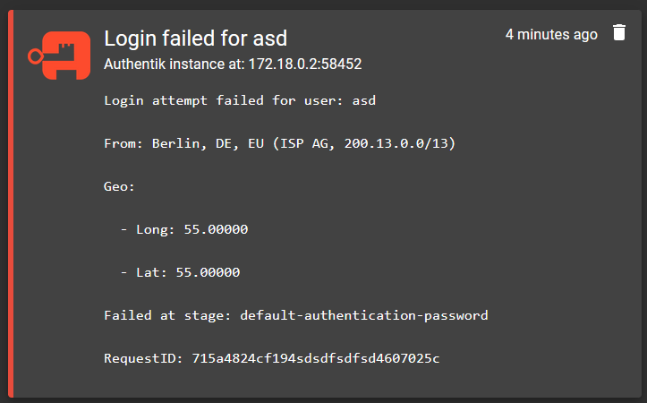

# Gotify Authentik Plugin

This plugin enables [Gotify](https://gotify.net) to receive and process webhooks from [Authentik](https://goauthentik.io). It parses and formats the login and login_failed events into notifications for administrators, with other events displayed in their raw form.

I just could not work the mappings in authentik to work with gotify..

## Features
- **Login Events**: Get notified when users successfully log in.
- **Login Failed Events**: Receive detailed notifications when login attempts fail.

## Installation

1. **Clone the repository:**
   ```bash
   git clone https://github.com/ckocyigit/gotify-authentik-plugin.git
   ```

2. **Build the plugin:**
   Navigate to the project directory and build the Go plugin using:
   ```bash
   go build -buildmode=plugin -o authentik_plugin.so
   ```

3. **Configure Gotify:**
   - Place the generated `authentik_plugin.so` in the `plugins` folder of your Gotify instance.

## Configuration in Authentik

To configure the webhook transport in Authentik, follow these steps:

1. **Create a Notification Transport in Authentik with Mode 'Webhook (generic)'**

2. **Copy the webhook URL from Gotify:**
   - Copy the webhook URL from the Gotify Plugin Settings page.

3. **Webhook Mapping:**
   - Keep Webhook Mapping empty.

4. **Enable 'Send once'** option.

5. **Create a Notification Rule:**
   - Example: Create a rule for the 'authentik Admins' Group and enable the newly created transport.

6. **Set Severity Level:**
   - Select Severity 'Notice'.

7. **Create and bind Policies:**
   - Action: Login Failed
     - App: authentik Core
   - Action: Login
     - App: authentik Core
   - The rest of the configuration should remain empty.

Other Rules/Policies are currently not supported natively, but will still be displayed in Gotify without being parsed correctly.


## Example login_failed Event



## License
This project is licensed under the MIT License - see the [LICENSE](LICENSE) file for details.

